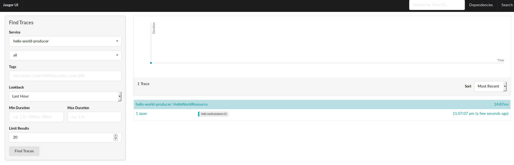
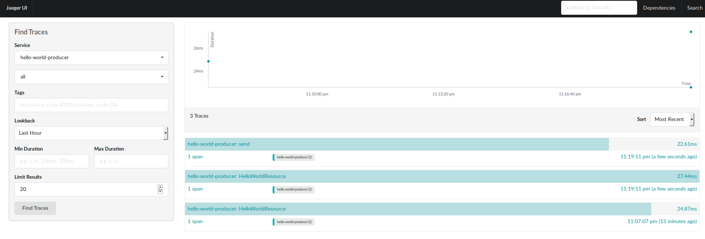
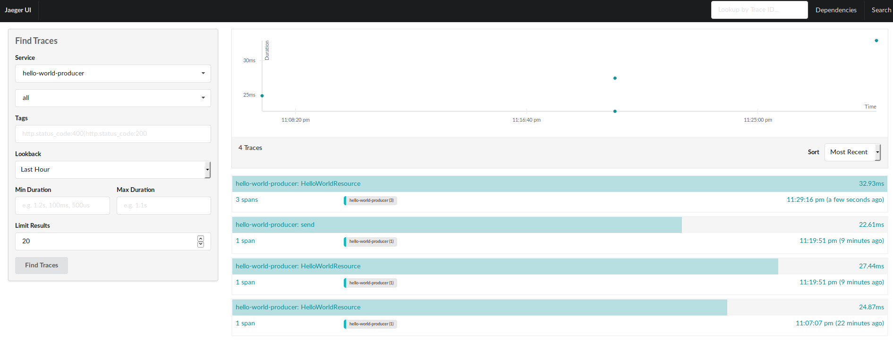
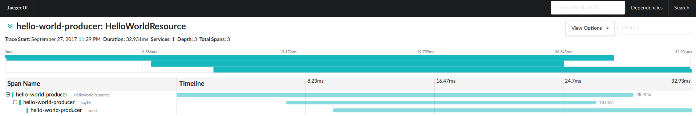
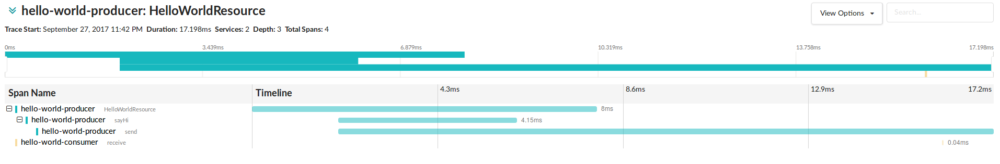
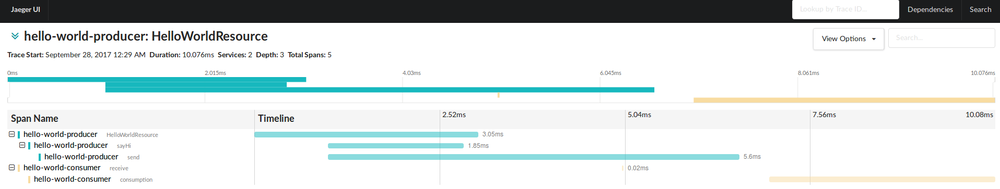

# Post: Tracing Kafka Applications

Tracing is one of the hardest time in integration or microservice development: 
knowing how a request impact your different components, and if your components
have behave as expected. 

This could be fairly easy if we have monolith where we have one database and
with some queries or checking one log file you can validate everything went 
well. 

Once you introduce distributed components and asynchronous communication 
this starts to get more complex and tedious.

OpenTracing (http://opentracing.io/) offers a way to solve this bringing a 
vendor neutral API to be able to create `spans` that represent the meaningful
tasks that form part of a `trace`.

## Use-Case

In this post we will see how to instrument Java applications that communicates 
using Apache Kafka as Event Log, and how visualize traces and analyze latency.

The scenario will be a simple Hello World Producer/Consumer. The producer
side will send a "greeting" event to "greetings-topic", and the consumer
side will poll events and print out to console.

## Technologies

* **Dropwizard**: Framework to run Web Services.

* **Apache Kafka**: Event Log.

* **OpenTracing and Jaeger**: API and instrumentation for distributed tracing.

## Implementation

Let's assume we have a simple application that produce `greetings` events
and another application that consumes and print those events.

To execute this applications let's first start a local version of Kafka:

### Install and Run Kafka

First, execute the script to install Kafka:

```bash
cd kafka/
./install-kafka.sh
```

Once it is installed, start Zookeeper and then one Kafka broker:

```bash
./start-zookeeper.sh
...
[2017-09-27 22:09:26,634] INFO binding to port 0.0.0.0/0.0.0.0:2181 (org.apache.zookeeper.server.NIOServerCnxnFactory)
...

```

```bash
./start-broker.sh
...
[2017-09-27 22:09:33,814] INFO Registered broker 0 at path /brokers/ids/0 with addresses: EndPoint(jeqo-Oryx-Pro,9092,ListenerName(PLAINTEXT),PLAINTEXT) (kafka.utils.ZkUtils)
...
[2017-09-27 22:09:33,817] INFO [Kafka Server 0], started (kafka.server.KafkaServer)
...
```

### Run Applications

#### Start Producer Side

To get started, let's start the producer side and test it.

Build the whole project: `./mvnw clean install`

And start the producer application:

```bash
cd hello-world-producer/
java -jar target/hello-world-producer.jar server config.yml
```

This will start a web server listening on port 8080.

We have a resource listening on context `/hello` and an operation
`GET /hello/{name}` that will call the `KafkaHelloWorldProducer`
that sends the record to Kafka.

Once the applications is started, we can call the operation with curl:

```bash
curl -XGET http://localhost:8080/hello/jeqo
done.
```

#### Start Consumer Side

Once producer side is started and running, we can start consumer side
to print out the events:

```bash
java -jar target/hello-world-consumer.jar server config.yml
...
Hi jeqo
...
```

So far these are common Kafka producer/consumer applications.

---
Source code on branch: steps/step-01
---

### OpenTracing Instrumentation

OpenTracing has enrich its integration throw projects that we can
contribute: https://github.com/opentracing-contrib/

We will follow the next steps:

1. Instrument Dropwizard

2. Instrument Kafka Producer

3. Instrument Kafka Consumer

4. Test complete Traces

#### Instrument Dropwizard

We are following this step to have a complete view since request is
received.

Firsts let's add Maven dependencies:

```xml
        <dependency>
            <groupId>io.opentracing</groupId>
            <artifactId>opentracing-api</artifactId>
            <version>0.30.0</version>
        </dependency>
        <dependency>
            <groupId>io.opentracing.contrib.dropwizard</groupId>
            <artifactId>dropwizard-opentracing</artifactId>
            <version>0.2.2</version>
        </dependency>
        <dependency>
            <groupId>com.uber.jaeger</groupId>
            <artifactId>jaeger-core</artifactId>
        </dependency>
```

First, the `opentracing-api` dependency.

Then `dropwizard-opentracing` that is the instrumentation for
DropWizard applications
that handles traces for all of your JAX-RS resource's operations by default.

And `jaeger-core` that implements OpenTracing API and
adds the Jaeger Java Client to connect to Jaeger Agent.

Then, we need to instantiate and register the Tracer on the Application
class:

```java
    final Tracer tracer = //(1)
        new com.uber.jaeger.Configuration(
            getName(),
            new com.uber.jaeger.Configuration.SamplerConfiguration("const", 1),
            new com.uber.jaeger.Configuration.ReporterConfiguration(
                true,  // logSpans
                "localhost",
                6831,
                1000,   // flush interval in milliseconds
                10000)  /*max buffered Spans*/)
            .getTracer();
    GlobalTracer.register(tracer); //(2)
    final DropWizardTracer dropWizardTracer = new DropWizardTracer(tracer); //(3)
    environment.jersey()
        .register(
            new ServerTracingFeature.Builder(dropWizardTracer)
                .withTraceAnnotations()
                .build());
```

In the first operation, we are instantiating a `Tracer` object with
Jaeger. Jaeger Agent should be running on port `localhost:6831`.

Then we are registering the `tracer` on the `GlobalTracer` helper, to
reference it from other layers.

And in the third step, we are integrating the tracer with DropWizard.
We are configuring this integration to only trace operations with
`@Trace` annotation: `.withTraceAnnotations()`

So, your resource class, should looks like this:

```java
  @GET
  @Path("{name}")
  @Trace
  public Response sayHi(@PathParam("name") final String name) {
    producer.send(name);
    return Response.accepted("done.").build();
  }
```

Let's install and start Jaeger, in its standalone version:

```
cd jaeger/
./install-jaeger.sh
```

And then:

```
./start-standalone.sh
```

Once it is started, you can go to: http://localhost:16686/search

And check its UI.

Now, let's run a first request to check if a trace is created:

```
curl http://localhost:8080/hello/jorge
```

And refresh the Jaeger UI:



---
Source code on branch: steps/step-02
---

#### Instrument Kafka Producer API

Cool! Now we have how long it takes to return a response on the
producer side :)

From here we can start asking:

How long it takes to execute the `send` operation by the Kafka
Producer? How long it takes to receive metadata from broker?
How long it takes to receive the record on the consumer side?
Did the consumer side receive the message?

This are the question we should be able to solve using OpenTracing.


Now let's add instrumentation for Kafka Clients:

First, let's add another dependency:

```
<dependency>
    <groupId>io.opentracing.contrib</groupId>
    <artifactId>opentracing-kafka-client</artifactId>
    <version>0.0.4</version>
</dependency>
```

https://github.com/opentracing-contrib/java-kafka-client

And let's wrap the tracer on a `TracingKafkaProducer`:

```java
    final KafkaProducer<String, String> kafkaProducer =
        new KafkaProducer<>(producerProperties, new StringSerializer(), new StringSerializer());
    final TracingKafkaProducer<String, String> tracingKafkaProducer =
        new TracingKafkaProducer<>(kafkaProducer, tracer);

```

The main difference, is that `TracingKafkaProducer` will inject
tracing context on Kafka Headers (supported since v0.11.0).

That's it, let's redeploy and test again.



Wait!!! but we only run one request, why do we have 2 traces???

The thing is that to create `spans` that are related, we need to create
a reference.

How do we do this?

First, we need to obtain the span from the request, and then create an
`ActiveSpan` that will wrap the execution of Kafka Client. Let's see
how this looks:

Let's go to the resource operation and add a parameter:

```java
  public Response sayHi(@Context final Request request,
                        @PathParam("name") final String name) {
```

Then we can use it to get the span using the DropwizardTracer:

```java
@Path("hello")
public class HelloWorldResource {
  private final DropWizardTracer dropWizardTracer; //(1)
  private final KafkaHelloWorldProducer producer;

  public HelloWorldResource(final DropWizardTracer dropWizardTracer,
                            final KafkaHelloWorldProducer producer) {
    this.dropWizardTracer = dropWizardTracer;
    this.producer = producer;
  }

  @GET
  @Path("{name}")
  @Trace
  public Response sayHi(@Context final Request request,  //(2)
                        @PathParam("name") final String name) {
    final Span span = dropWizardTracer.getSpan(request);  //(3)

    try (ActiveSpan activeSpan =
             dropWizardTracer.getTracer()
                 .buildSpan("sayHi")
                 .asChildOf(span)
                 .startActive()) {  //(4)
      producer.send(name);
      return Response.accepted("done.").build();
    }
  }
}
```

First we inject the Tracer, then we get the span from Request,
and finally we create an ActiveSpan that wraps the producer.



And if we go to the detail we can get more insight from the execution:



We can get a more deep understanding about the trace execution,
how the callback works on the producer side, processing the metadata
asynchronously, and so on.

#### Instrument Kafka Consumer API

Ok, so far so good. We have a complete visibility over the execution on
the producer side. But what happen next? How the consumer side reacts?

To know that using OpenTracing instrumentation we will using the same
integration of OpenTracing with Kafka, but it is a bit different.

Again, let's start adding dependencies:

```xml
        <dependency>
            <groupId>io.opentracing</groupId>
            <artifactId>opentracing-api</artifactId>
            <version>0.30.0</version>
        </dependency>
        <dependency>
            <groupId>com.uber.jaeger</groupId>
            <artifactId>jaeger-core</artifactId>
            <version>0.20.6</version>
        </dependency>
        <dependency>
            <groupId>io.opentracing.contrib</groupId>
            <artifactId>opentracing-kafka-client</artifactId>
            <version>0.0.4</version>
        </dependency>
```

`opentracing-api` and `jaeger-core` for instrumentation and `opentracing-kafka-client`
for integration with Kafka Clients.

Then, we need to instantiate the `Tracer`, but without the `DropwizardTracer`
given that we don't need to trace HTTP endpoints:

```java
    //Instantiate and register Tracer
    final Tracer tracer =
        new com.uber.jaeger.Configuration(
            getName(),
            new com.uber.jaeger.Configuration.SamplerConfiguration("const", 1),
            new com.uber.jaeger.Configuration.ReporterConfiguration(
                true,  // logSpans
                "localhost",
                6831,
                1000,   // flush interval in milliseconds
                10000)  /*max buffered Spans*/)
            .getTracer();
    GlobalTracer.register(tracer);
```

And then, instantiate the `TracingKafkaConsumer`:

```java
    final TracingKafkaConsumer<String, String> tracingKafkaConsumer =
        new TracingKafkaConsumer<>(kafkaConsumer, tracer);

    //Define Runnable Handler
    final KafkaGreetingsHandler greetingsHandler =
        new KafkaGreetingsHandler(tracingKafkaConsumer)
```

Should be enough. Let's try it out:

(build and run your consumer side)

```
./mvnw clean install
 java -jar target/hello-world-consumer.jar server config.yml
```

```
 curl http://localhost:8080/hello/jorge
```



That's great! Now we have how long it takes to receive a record on the
consumer side.

But, what if we want to measure the complete execution, since we get
the message until we commit it?

To do this, we can add an `ActiveSpan` on the consumption side:

```java
        for (ConsumerRecord<String, String> consumerRecord : consumerRecords) {
          try (ActiveSpan activeSpan =
                   GlobalTracer.get()
                       .buildSpan("consumption")
                       //.asChildOf(context)
                       .startActive()) {
            System.out.println(consumerRecord.value());

            kafkaConsumer.commitSync();
          }
        }
```

But where is the context coming from?

Well, as `TracingKafkaProducer` inject tracing contexts on Headers,
we can use `TracingKafkaUtils` to extract it, and reference it:

```java
        for (ConsumerRecord<String, String> consumerRecord : consumerRecords) {
          final SpanContext context =
              TracingKafkaUtils.extractSpanContext(consumerRecord.headers(), tracer);
          try (ActiveSpan activeSpan =
                   tracer.buildSpan("consumption")
                       .asChildOf(context)
                       .startActive()) {
            System.out.println(consumerRecord.value());

            kafkaConsumer.commitSync();
          }
        }
```



